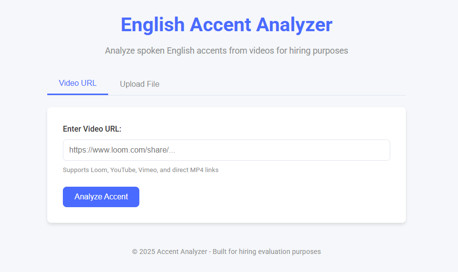
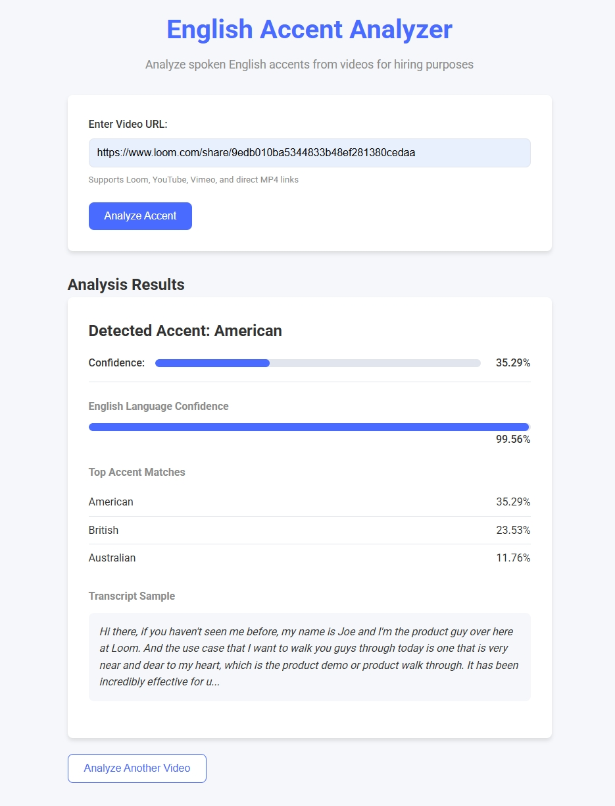

<p align="center">
  
</p>

<h1 align="center">🎙️ English Accent Analyzer</h1>

<p align="center">
  <strong>Automatically detect and visualize English accents from video URLs or uploads!</strong><br>
  <em>Powered by yt-dlp, Whisper, and a simple accent-classifier</em>
</p>

<p align="center">
  <a href="https://demo-hishambarakat-accent-analzyer-1027680908961.us-central1.run.app/">
    
  </a>
  <a href="LICENSE">
    
  </a>
  <a href="https://github.com/your-username/english-accent-analyzer/stargazers">
    
  </a>
</p>

---

## 🚀 Overview

A lightweight Flask app that:
- Downloads audio from any video URL or file.
- Transcribes speech with Whisper.
- Predicts one of eight English accents (e.g., American, British, Indian).
- Returns a JSON containing: primary accent, confidence, top-3 accents, English confidence, and a transcript snippet.

---

## 🎯 Features

- **Universal input**: Paste a Loom/YouTube URL or upload a video file (up to 100 MB).  
- **Fast transcription**: Whisper-powered, high-quality text output.  
- **Accent detection**: Transformer or rule-based classifier for eight accent categories.  
- **JSON results**: Easy to integrate into other tools or dashboards.  
- **Serverless-ready**: Dockerized and tested on Google Cloud Run (auto-scale, free-tier eligible).

---

## ✨ Screenshots

<p float="left">
  
  
</p>

---

## 📥 Getting Started

Follow these steps to run locally or jump to [Deployment](#⛅-deployment) for Cloud Run.

### Prerequisites

- **Python 3.10+**
- **ffmpeg** (for audio extraction)
- **docker** (optional)
- **Git**

### 1. Clone the Repository

```bash
git clone git@github.com:your-username/english-accent-analyzer.git
cd english-accent-analyzer
```

### 2. (Optional) Create & Activate a Virtual Environment

```bash
python3 -m venv venv
source venv/bin/activate   # macOS/Linux
venv\Scripts\activate      # Windows PowerShell
```

### 3. Install Dependencies

```bash
pip install --upgrade pip
pip install -r requirements.txt
```

### 4. Run Locally

```bash
export FLASK_APP=app.py
export FLASK_ENV=production
flask run --host=0.0.0.0 --port=8080
```

Open [http://localhost:8080](http://localhost:8080), paste a video URL or upload a file, and click "Analyze Accent."

---

## 🐳 Docker Usage

1. **Build the image**

   ```bash
   docker build -t accent_analyzer:latest .
   ```

2. **Run the container**

   ```bash
   docker run --rm -p 8080:8080 accent_analyzer:latest
   ```

3. **Test with `curl`**

   ```bash
   curl -X POST http://localhost:8080/analyze \
        -H "Content-Type: application/x-www-form-urlencoded" \
        --data-urlencode "url=https://www.loom.com/share/your-video-id"
   ```

---

## ⛅ Deployment

**Deploy to Google Cloud Run**:

1. **Configure gcloud**

   ```bash
   gcloud auth login
   gcloud config set project your-gcp-project-id
   gcloud auth configure-docker
   ```

2. **Tag & Push Image**

   ```bash
   docker tag accent_analyzer:latest \
     gcr.io/your-gcp-project-id/accent_analyzer:latest

   docker push gcr.io/your-gcp-project-id/accent_analyzer:latest
   ```

3. **Deploy Service**

   ```bash
   gcloud run deploy english-accent-analyzer \
     --image gcr.io/your-gcp-project-id/accent_analyzer:latest \
     --region us-central1 \
     --platform managed \
     --allow-unauthenticated \
     --memory 2Gi \
     --timeout 300s
   ```

4. **Visit the Endpoint**

   ```
   https://english-accent-analyzer-abcdefg-uc.a.run.app
   ```

---

## 🎨 Customization

* **Max upload size**: Adjust `app.config['MAX_CONTENT_LENGTH']` in `app.py`.
* **Accent classes**: Edit `ACCENT_CLASSES` in `accent_analyzer.py`.
* **ASR backend**: Swap out `whisper-timestamped` for any other speech-to-text library.

---

## 🛡️ Security & Best Practices

* **SECRET\_KEY**: Change from the default `dev_key_change_in_production`.
* **HTTPS**: Cloud Run provides SSL by default.
* **Autoscaling**: For production, set `--min-instances=1` to avoid cold starts.
* **CI/CD**: Use GitHub → Cloud Build for automatic deploys on each push.

---

## 📄 License

This project is licensed under the [MIT License](LICENSE).

---

## 🙏 Acknowledgements

* **[yt-dlp](https://github.com/yt-dlp/yt-dlp)** for robust video/audio extraction.
* **[Whisper Timestamped](https://github.com/jannikmi/whisper-ts)** for easy transcription.
* **Hugging Face Transformers** for quick accent-classifier prototyping.
* **Google Cloud Run** for seamless container hosting.

---

<p align="center">
  Made with ❤️ by Hisham Barakat 
  • <a href="https://github.com/hishambarakat16">GitHub</a> • <a href="mailto:hishambarakat16@gmail.com">Contact</a>
</p>
